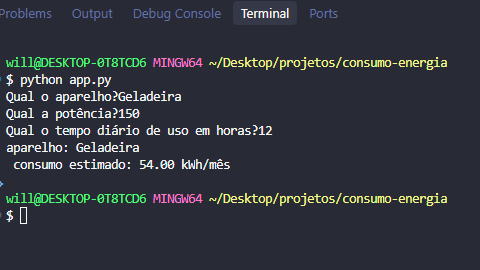

# ⚡ CALCULADORA DE CONSUMO DE ENERGIA

## 🎯 OBJETIVO

O objetivo deste projeto é calcular o consumo de energia elétrica mensal de um aparelho.

## 🐍 LINGUAGEM UTILIZADA


## 🚀 COMO EXECUTAR

Execute o arquivo `app.py` utilizando o Python.

## 🧮 FÓRMULA UTILIZADA

O consumo mensal é calculado através da seguinte fórmula:

**Consumo mensal = (Potência × Horas de uso por dia × 30) ÷ 1000**

### 📌 Exemplo

Se um aparelho possui:

- ⚡ Potência: 150 W
- ⏰ Uso diário: 12 horas

O cálculo será:

**(150 × 12 × 30) ÷ 1000 = 54 kWh/mês**

### 💻 Resultado

```text
Aparelho: Geladeira
Consumo estimado: 54.00 kWh/mês

